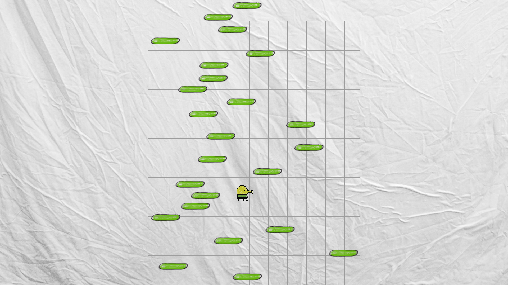
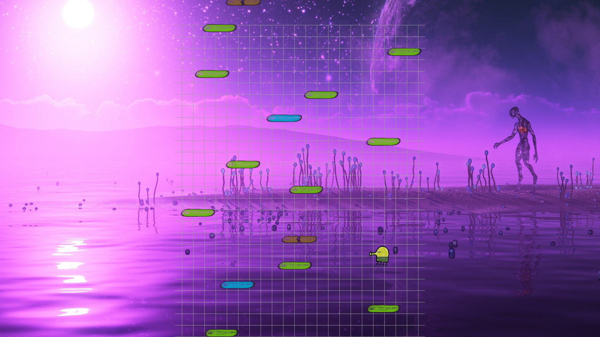
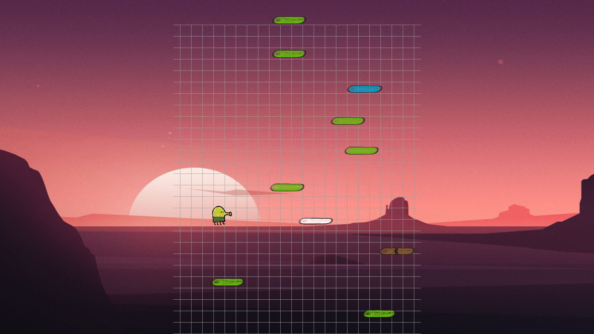
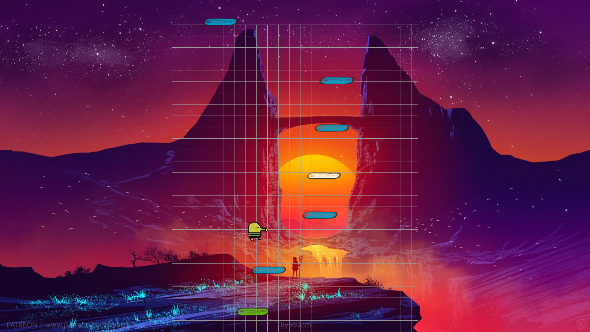

# Doodle jump project

## Зачем?

В детстве мне очень нравилась эта игра, и я решил реализовать ее.
Я сделал несколько типов платформ, скины для игрока и различные фоны.
Также я написал алгоритм генерации уровня, меняющийся в зависимости от количества набранных очков.

Весь код написан мною на первом курсе в процедурном стиле на языке си.

Ниже прилагаю скриншоты игры.

