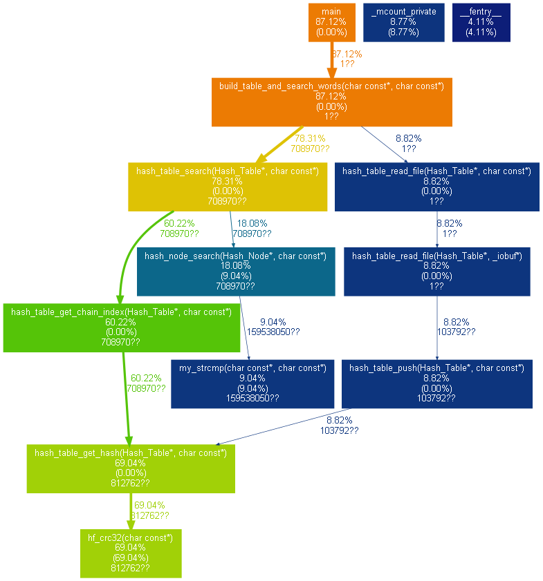
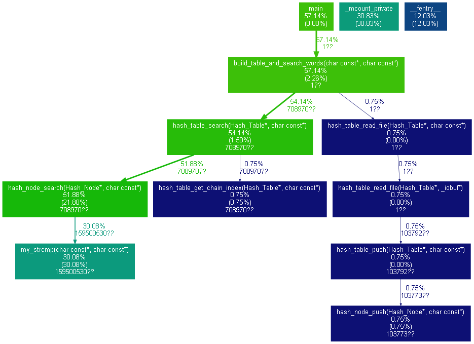
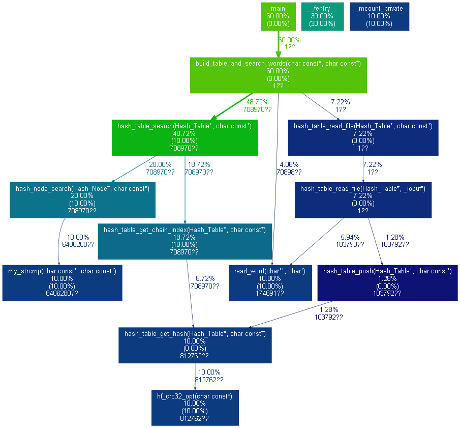
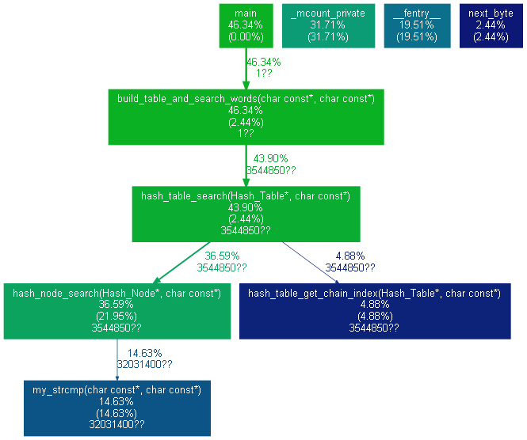
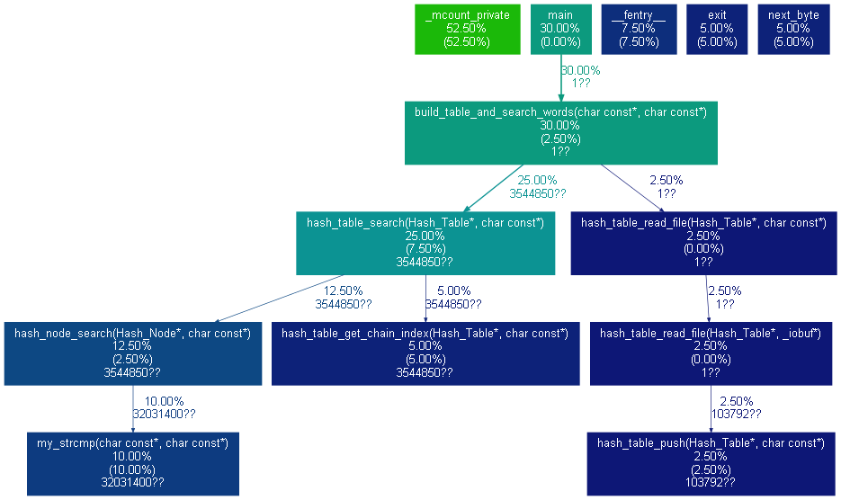

# Лабраторная работа по оптимизации работы с хеш-таблицой

## Введение

Хеш-табли́ца — это структура данных, реализующая интерфейс ассоциативного массива, разбивающая данные на основе значений некоторой хеш-функции.  
Так как размер хеш-таблицы на практике сильно меньше количества данных, при добавлении очередного значения его хеш может совпасть с некоторым уже хранящимся значением. Такая ситуация называется коллизией.  
Существует несколько способов обработки коллизий, однако в этой работе мы ограничимся методом цепочек. Он заключается в том, что данные с одинаковым хешом хранятся в связном списке, указатель на начало которого хранится в соответствующей ячейке хеш-таблицы.

## Цель работы

Цель работы заключается в оптимизации времени работы программы, использующей хеш-таблицу.  
Она сначала добавляет в нее слова из романа "1984", а после ищет в ней слова из романа "Мастер и Маргарита" и выводит процент найденных слов.  

## Ход работы

Был произведен запуск базовой версии программы с профилированием с помощью программы gprof. Были получены следующие результаты:

Версия программы | Время работы, ms   | Абсолютный коеффициент ускорения | Относительный коэффициент ускорения
----------------:|:------------------:|:--------------------------------:|:------------------
Базовая                     |  42781 $\pm$ 950     |    1                 |     -

Как видно из графа, наибольшее время работы программы занимает выполнение хеш-функции hf_crc32.

Во второй версии эта функция была оптимизирована при помощи интринсика _mm_crc32_u8 из библиотеки "immintrin.h".
Ниже приведены результаты замеров времени работы второй версии программы:

Версия программы | Время работы, ms   | Абсолютный коеффициент ускорения | Относительный коэффициент ускорения
----------------:|:------------------:|:--------------------------------:|:------------------
Базовая                     |  42781 $\pm$ 950     |    1                 |     -
Оптимизация с интринсиками  |  15680 $\pm$ 313     |    2.72  $\pm$ 0.08  |     2.72  $\pm$ 0.41

Теперь более половины времени работы программы занимает выполнение функции my_strcmp, использующейся для поиска слов в цепочках. Наиболее очевидной оптимизацией в данном случае будет увеличение размера хеш-таблицы. Новый размер
был взят равным 499.

Версия программы | Время работы, ms   | Абсолютный коеффициент ускорения | Относительный коэффициент ускорения
----------------:|:------------------:|:--------------------------------:|:------------------
Базовая                     |  42781 $\pm$ 950     |    1                 |     -
Оптимизация с интринсиками  |  15680 $\pm$ 313     |    2.72  $\pm$ 0.08  |     2.72  $\pm$ 0.41
Оптимизация размера таблицы |  780   $\pm$ 15      |    54.85 $\pm$ 1.62  |     20.10 $\pm$ 0.92

В качестве дальнейшей оптимизации, перепишем функцию hf_crc32 на чистом ассемблере.  
Это можно сделать двумя способами: ассемблерная вставка внутри тела функции и подлинковка  
ассемблерного файла. Ниже приведены результаты замеров времени работы программы при этих оптимизациях.  
(сперва для вставки, после для подлинковки)

Версия программы | Время работы, ms   | Абсолютный коеффициент ускорения | Относительный коэффициент ускорения
----------------:|:------------------:|:--------------------------------:|:------------------
Базовая                     |  42781 $\pm$ 950     |    1                 |     -
Оптимизация с интринсиками  |  15680 $\pm$ 313     |    2.72  $\pm$ 0.08  |     2.72  $\pm$ 0.41
Оптимизация размера таблицы |  780   $\pm$ 15      |    54.85 $\pm$ 1.62  |     20.10 $\pm$ 0.92
Ассемблерная вставка        |  577   $\pm$ 12      |    74.14 $\pm$ 2.22  |     1.35  $\pm$ 0.13
Ассемблерная подлинковка    |  690   $\pm$ 13      |    62.00 $\pm$ 2.34  |     1.13  $\pm$ 0.12

## Вывод

Самой эффективной оптимизацией оказался простой подбор правильного параметра таблицы.  
Использование интринсиков также дало значительный прирост в производительности.  
использование ассемблерной вставки также помогает выиграть несколько десятков процентов в скорости работы программы,  однако подлинковка дает чуть меньший прирост. (скорее всего, из-за невозможности inline'a хеш-функции).